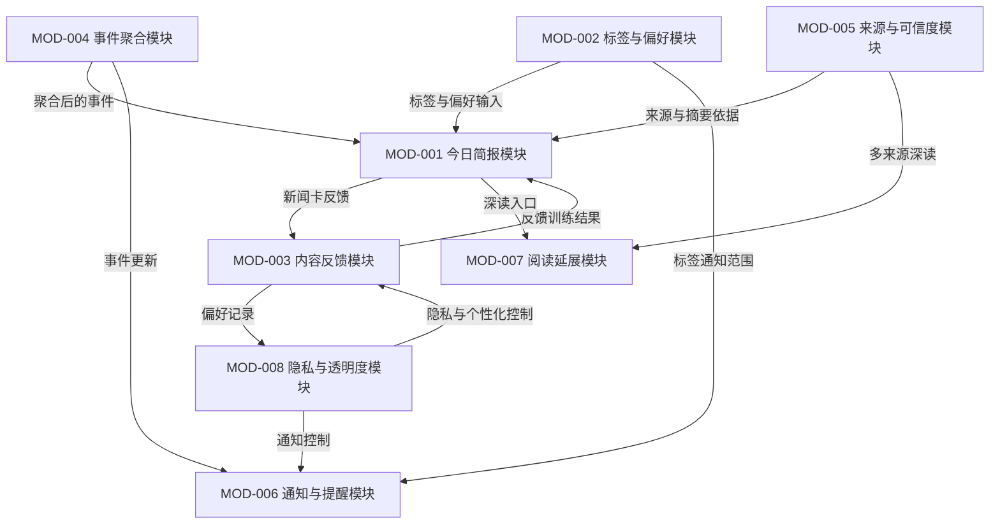
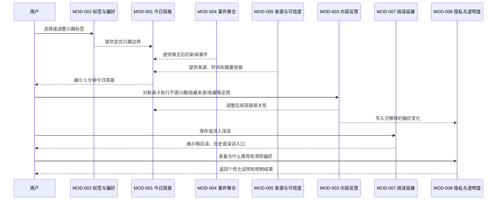

# 04 产品架构设计

> 本文档定义产品能力结构、功能模块、模块边界、核心业务对象和需求到功能任务的组织关系。它不是技术架构文档，不写数据库、接口、缓存、消息队列、部署或模型供应商。

## 0. 文档元信息

| 字段 | 内容 |
|---|---|
| document_id | PRODUCT-ARCH-001 |
| instance_id | SPI-001 |
| version | v0.1 |
| product_name | 每日新闻 App |
| base_requirement_analysis | REQ-ANALYSIS-001 |
| base_analysis_review | analysis-human-review / APR-001 |
| generated_at | 2026-05-27 |
| document_goal | 定义产品模块结构、模块边界、核心业务对象和 REQ 到 FEAT 的组织关系 |
| downstream_consumers | 产品经理 AI / 架构师 AI / 研发 AI / 测试 AI / 前端 AI |
| review_gate | product-architecture-human-review |
| review_status | approved |

## 1. 产品架构目标

| arch_goal_id | 架构目标 | 关联产品目标 | 说明 |
|---|---|---|---|
| PARCH-GOAL-001 | 把快读和深读拆成清晰的产品层级 | GOAL-001 / GOAL-006 | 首页优先帮助用户在短时间内判断重要内容，详情页再承载来源、背景和多视角 |
| PARCH-GOAL-002 | 让显式标签成为个性化主入口 | GOAL-002 | 定制化标签是用户明确提出的必须能力，需独立成模块并贯穿首页、通知和反馈 |
| PARCH-GOAL-003 | 让推荐、反馈和隐私形成可解释闭环 | GOAL-003 / GOAL-004 | 个性化不能只做黑箱推荐，需要用户能理解和修正内容流 |
| PARCH-GOAL-004 | 用事件聚合和克制通知降低新的信息噪音 | GOAL-001 / GOAL-005 | 产品目标是减少信息爆炸，不应通过重复报道和高频通知制造新的负担 |
| PARCH-GOAL-005 | 建立可追踪的 MOD / OBJ / FEAT 结构 | GOAL-001 至 GOAL-006 | 供后续 PRD、功能任务、UI、测试和原型生成稳定引用 |

## 2. 模块划分策略

| strategy_id | 划分方式 | 是否采用 | 采用 / 不采用原因 |
|---|---|---|---|
| ARCH-STRATEGY-001 | 按用户任务组织 | 是 | 核心任务是“短时间看懂今日新闻”“定制兴趣”“从快读进入深读”，适合组织首页和详情体验 |
| ARCH-STRATEGY-002 | 按业务流程组织 | 部分采用 | 采用“兴趣初始化 -> 简报浏览 -> 反馈训练 -> 深读/通知”的主流程，但不把流程本身当模块边界 |
| ARCH-STRATEGY-003 | 按产品能力组织 | 是 | 便于把标签、事件聚合、来源可信度、通知、隐私等能力拆清楚 |
| ARCH-STRATEGY-004 | 按页面 / 端组织 | 否 | 现在是产品架构阶段，页面将在 UI IA 中生成，不能把首页、详情页直接替代产品模块 |
| ARCH-STRATEGY-005 | 按企业组织角色组织 | 否 | 当前是个人用户 App，暂不涉及企业组织、运营后台或采编角色 |

## 3. 产品能力地图

| capability_id | 能力名称 | 能力类型 | 说明 | 关联需求 |
|---|---|---|---|---|
| CAP-001 | 个性化快读简报 | 核心用户能力 | 按用户兴趣、重要度和时间成本组织每日 / 当前时段新闻 | REQ-001 |
| CAP-002 | 兴趣标签定制 | 核心用户能力 | 支持选择、编辑、排序、删除、临时关注标签 | REQ-002 / REQ-006 |
| CAP-003 | 内容反馈与偏好训练 | 支撑能力 | 用户通过反馈动作影响后续内容相关性 | REQ-003 / REQ-007 |
| CAP-004 | 事件聚合与去重 | 支撑能力 | 将同一新闻事件的多篇报道合并为事件视图，减少重复阅读 | REQ-004 |
| CAP-005 | 来源透明与多视角 | 体验能力 | 为摘要、事件和深读提供来源、时间、原文、多视角入口 | REQ-005 |
| CAP-006 | 克制型通知 | 体验能力 | 基于标签、重要度、频率上限和免打扰规则提供提醒 | REQ-008 |
| CAP-007 | 阅读延展 | 核心用户能力 | 收藏、稍后读、阅读历史，支持从快读延伸到深读 | REQ-009 |
| CAP-008 | 个性化隐私与透明度 | 管理能力 | 说明个性化依据，提供偏好清除、个性化开关和隐私控制 | REQ-010 |

## 4. 功能模块清单

| module_id | 模块名称 | 模块职责 | 包含能力 | 不包含内容 | 关联需求 | 关联功能任务 |
|---|---|---|---|---|---|---|
| MOD-001 | 今日简报模块 | 组织用户进入 App 后的核心快读体验，让用户用最少时间获得高相关新闻判断 | CAP-001 | 不负责标签维护、事件判定、通知发送、隐私设置 | REQ-001 | FEAT-001 |
| MOD-002 | 标签与偏好模块 | 管理用户显式兴趣边界，包括标签选择、编辑、排序、推荐和冷启动 | CAP-002 | 不负责根据反馈实时排序新闻，不负责通知规则执行 | REQ-002 / REQ-006 | FEAT-002 / FEAT-006 |
| MOD-003 | 内容反馈模块 | 接收用户对新闻卡、标签、来源的反馈，并把反馈转化为可解释的偏好调整 | CAP-003 | 不直接展示完整新闻详情，不独立决定来源可信度 | REQ-003 / REQ-007 | FEAT-003 / FEAT-007 |
| MOD-004 | 事件聚合模块 | 将同一事件下的多篇报道组织成事件，处理去重、多来源和事件更新 | CAP-004 | 不裁定事实真伪，不承担内容授权或采编职责 | REQ-004 | FEAT-004 |
| MOD-005 | 来源与可信度模块 | 在摘要、新闻卡和事件详情中表达来源、时间、原文、多视角和摘要回溯 | CAP-005 | 不做复杂媒体评级平台，不替代用户判断 | REQ-005 | FEAT-005 |
| MOD-006 | 通知与提醒模块 | 控制突发新闻、标签新闻和简报提醒的触达方式、频率和解释 | CAP-006 | 不做增长型高频推送，不独立维护兴趣标签 | REQ-008 | FEAT-008 |
| MOD-007 | 阅读延展模块 | 支持收藏、稍后读、阅读历史和从简报进入深读的轻量延展 | CAP-007 | 不做笔记、协作知识库或社区讨论 | REQ-009 | FEAT-009 |
| MOD-008 | 隐私与透明度模块 | 管理个性化说明、偏好清除、个性化开关和隐私控制 | CAP-008 | 不承担完整账号体系、支付、企业权限 | REQ-003 / REQ-010 | FEAT-010 |

## 5. 模块边界说明

| module_id | 输入 | 输出 | 上游模块 | 下游模块 | 边界规则 |
|---|---|---|---|---|---|
| MOD-001 | 用户标签、内容反馈、事件聚合结果、来源信息 | 今日简报、新闻卡、阅读入口 | MOD-002 / MOD-003 / MOD-004 / MOD-005 | MOD-003 / MOD-004 / MOD-007 | 只负责“快读呈现和选择入口”，不直接维护标签、事件和隐私规则 |
| MOD-002 | 用户选择、搜索标签、推荐标签包、历史偏好 | 标签集合、标签排序、标签状态 | 无 | MOD-001 / MOD-003 / MOD-006 / MOD-008 | 显式兴趣边界归本模块；基于行为的偏好训练归 MOD-003 |
| MOD-003 | 新闻卡反馈、来源反馈、标签反馈、阅读行为 | 偏好调整说明、内容反馈记录 | MOD-001 / MOD-002 / MOD-007 | MOD-001 / MOD-008 | 反馈必须可解释，并能被隐私与透明度模块展示或清除 |
| MOD-004 | 新闻报道、事件线索、来源报道集合 | 事件卡、去重结果、事件更新 | MOD-005 | MOD-001 / MOD-006 / MOD-007 | 聚合负责“同事件组织”，不负责来源可信度评价 |
| MOD-005 | 来源、发布时间、原文链接、摘要依据、多视角报道 | 来源说明、摘要回溯、多视角入口 | MOD-004 | MOD-001 / MOD-007 | 负责信任表达，不替代事实核查或立场裁判 |
| MOD-006 | 标签偏好、事件更新、重要度、免打扰规则 | 通知、提醒解释、通知设置状态 | MOD-002 / MOD-004 / MOD-008 | MOD-001 / MOD-007 | 通知必须有频率上限和可解释触发原因 |
| MOD-007 | 用户收藏、稍后读、阅读历史、深读动作 | 保存列表、历史入口、继续阅读入口 | MOD-001 / MOD-004 / MOD-005 | MOD-003 | 阅读延展只保留轻量行为，不扩展成知识库 |
| MOD-008 | 用户隐私选择、个性化依据、反馈记录 | 个性化说明、偏好清除、开关状态 | MOD-002 / MOD-003 / MOD-006 | MOD-001 / MOD-003 / MOD-006 | 管理透明度和控制权，不定义具体内容排序 |

## 6. 核心业务对象

| object_id | 业务对象 | 业务含义 | 关键属性概念 | 关联模块 | 关联规则 |
|---|---|---|---|---|---|
| OBJ-001 | 用户兴趣画像 | 用户显式选择与行为反馈形成的兴趣边界 | 标签、来源偏好、反馈、更新时间、可清除状态 | MOD-002 / MOD-003 / MOD-008 | BR-001 个性化可解释规则 |
| OBJ-002 | 兴趣标签 | 用户关注或排除的主题单位 | 标签名称、标签类型、排序、关注状态、排除状态 | MOD-002 | BR-002 标签管理规则 |
| OBJ-003 | 新闻条目 | 单篇或单来源新闻内容入口 | 标题、摘要、来源、发布时间、关联事件、关联标签 | MOD-001 / MOD-005 / MOD-007 | BR-003 新闻卡展示规则 |
| OBJ-004 | 新闻事件 | 由多篇新闻条目聚合形成的同一事件 | 事件标题、核心摘要、关联报道、更新时间、多视角入口 | MOD-004 / MOD-005 | BR-004 事件聚合规则 |
| OBJ-005 | 今日简报 | 给用户短时间阅读的新闻集合 | 简报时间、条目数量、预计阅读时长、覆盖标签、重要性说明 | MOD-001 | BR-005 快读简报规则 |
| OBJ-006 | 内容反馈 | 用户对新闻、来源、标签或事件的显式反馈 | 反馈类型、反馈对象、反馈原因、影响说明 | MOD-003 / MOD-008 | BR-006 反馈训练规则 |
| OBJ-007 | 新闻来源 | 新闻内容的媒体、频道或用户指定来源 | 来源名称、来源类型、用户关注/隐藏状态、展示说明 | MOD-005 / MOD-002 / MOD-003 | BR-007 来源透明规则 |
| OBJ-008 | 通知规则 | 用户对标签和重大事件提醒的控制 | 标签范围、重要度阈值、频率上限、免打扰时间 | MOD-006 / MOD-008 | BR-008 克制通知规则 |
| OBJ-009 | 阅读延展项 | 用户收藏、稍后读或历史中的内容记录 | 保存类型、关联新闻/事件、保存时间、阅读状态 | MOD-007 | BR-009 阅读延展规则 |
| OBJ-010 | 个性化透明说明 | 向用户解释内容为何出现、如何调整的说明对象 | 触发原因、关联标签、关联反馈、可操作入口 | MOD-008 / MOD-001 / MOD-003 | BR-010 透明度说明规则 |

## 7. 需求到模块映射

| req_id | 需求描述 | 归属模块 | 映射理由 | 后续功能任务 |
|---|---|---|---|---|
| REQ-001 | 系统应提供每日 / 当前时段的个性化快读简报，让用户在短时间内完成新闻判断 | MOD-001 | 今日简报是用户核心入口和快读体验载体 | FEAT-001 |
| REQ-002 | 系统应支持用户定制、编辑、排序、删除兴趣标签 | MOD-002 | 标签是显式兴趣边界，需独立管理 | FEAT-002 |
| REQ-003 | 系统应基于标签、来源、反馈和阅读行为持续优化内容相关性 | MOD-003 / MOD-008 | 反馈训练归 MOD-003，透明控制归 MOD-008 | FEAT-003 |
| REQ-004 | 系统应将同一事件的多篇报道聚合，减少重复阅读 | MOD-004 | 同事件聚合和去重需要独立产品边界 | FEAT-004 |
| REQ-005 | 系统应为新闻摘要提供来源、时间、原文和多视角入口 | MOD-005 | 信任表达、来源透明和多视角归一个模块 | FEAT-005 |
| REQ-006 | 系统应提供轻量化首次个性化配置，降低冷启动门槛 | MOD-002 | 冷启动本质是初始标签和偏好建立 | FEAT-006 |
| REQ-007 | 系统应允许用户通过“不感兴趣、减少此类、隐藏来源、收藏、稍后读”等动作训练内容流 | MOD-003 / MOD-007 | 反馈训练归 MOD-003；收藏和稍后读归 MOD-007 | FEAT-007 |
| REQ-008 | 系统应支持基于标签和重要度的克制通知 | MOD-006 | 通知策略、频率和解释归提醒模块 | FEAT-008 |
| REQ-009 | 系统应支持保存、稍后阅读和阅读历史，方便从快读延伸到深读 | MOD-007 | 阅读延展能力独立于首页快读和事件聚合 | FEAT-009 |
| REQ-010 | 系统应提供个性化设置说明和隐私控制 | MOD-008 | 个性化透明、偏好清除和开关是信任底座 | FEAT-010 |

## 8. 模块到功能任务映射

| module_id | 模块名称 | 功能任务 | 任务边界说明 | 任务生成状态 |
|---|---|---|---|---|
| MOD-001 | 今日简报模块 | FEAT-001 个性化今日简报 | 生成首页快读、摘要、重要性解释和阅读入口；不生成标签管理规则 | 待生成 |
| MOD-002 | 标签与偏好模块 | FEAT-002 兴趣标签选择与编辑；FEAT-006 轻量化兴趣初始化 | 包含标签选择、编辑、推荐、跳过、稍后完善；不处理新闻卡反馈 | 待生成 |
| MOD-003 | 内容反馈模块 | FEAT-003 内容反馈与偏好训练；FEAT-007 新闻卡反馈菜单 | 包含反馈动作、反馈影响说明和偏好调整；不处理隐私开关本身 | 待生成 |
| MOD-004 | 事件聚合模块 | FEAT-004 同事件聚合与去重 | 包含事件视图、重复报道合并、事件更新；不做事实裁判 | 待生成 |
| MOD-005 | 来源与可信度模块 | FEAT-005 摘要来源与多视角入口 | 包含来源、时间、原文、多视角、摘要回溯；不做媒体评级平台 | 待生成 |
| MOD-006 | 通知与提醒模块 | FEAT-008 克制型标签通知 | 包含标签通知、频率上限、免打扰、通知原因；不做增长推送 | 待生成 |
| MOD-007 | 阅读延展模块 | FEAT-009 收藏、稍后读与历史 | 包含轻量保存与继续阅读；不做笔记或协作知识库 | 待生成 |
| MOD-008 | 隐私与透明度模块 | FEAT-010 个性化说明与偏好清除 | 包含个性化解释、清除偏好、开关控制；不做完整账号体系 | 待生成 |

## 9. 产品架构图

## 10. 用户任务流与模块协作图

## 11. 新项目与迭代处理规则

| 场景 | 处理方式 |
|---|---|
| 新项目 | 当前为新项目，先建立 MOD-001 至 MOD-008 的完整模块地图，再生成 FEAT。 |
| 功能迭代 | 后续如新增“音频简报 / 本地新闻 / 多语言”等能力，需先判断是否新增模块或归入既有模块。 |
| 跳过产品架构 | 不适用；当前已按 Design 第一节点生成产品架构。 |
| 已有产品架构 | 当前为首版 PRODUCT-ARCH-001，后续变更必须基于本文件和 `10-product-baseline-change.md` 追踪。 |

## 12. 产品架构决策表

| decision_id | 决策项 | 当前建议 | 可选动作 | 用户选择 | 影响范围 |
|---|---|---|---|---|---|
| ARCH-DEC-001 | 模块划分方式 | 按用户任务 + 产品能力组织 | 接受 / 合并模块 / 拆分模块 / 重命名模块 / 重新生成 / 其他 | 接受 | MOD / FEAT / SCR |
| ARCH-DEC-002 | 是否保留 8 个模块 | 保留 MOD-001 至 MOD-008；这能清晰隔离快读、标签、反馈、聚合、可信度、通知、阅读延展、隐私 | 接受 / 合并 MOD-003 与 MOD-008 / 合并 MOD-005 与 MOD-004 / 删除 MOD-007 / 其他 | 接受 | MOD / FEAT / PRD |
| ARCH-DEC-003 | 标签模块是否作为一级模块 | 保留 MOD-002 作为一级模块 | 接受 / 降级为今日简报内功能 / 拆分标签管理和来源管理 / 其他 | 接受 | MOD / FEAT / UI |
| ARCH-DEC-004 | 事件聚合是否独立成模块 | 保留 MOD-004 独立模块 | 接受 / 并入今日简报 / 并入来源可信度 / 标记待确认 | 接受 | MOD / FEAT / AC |
| ARCH-DEC-005 | 来源与可信度模块边界 | 保留 MOD-005，只做来源透明、多视角和摘要回溯，不做事实裁判 | 接受 / 扩展为事实核查 / 简化为来源展示 / 其他 | 接受 | MOD / FEAT / BR |
| ARCH-DEC-006 | 是否保留通知模块 | 保留 MOD-006，但严格定位为克制型提醒 | 接受 / 暂不做通知 / 并入标签模块 / 其他 | 接受 | MOD / FEAT / UI |
| ARCH-DEC-007 | 是否保留阅读延展模块 | 保留 MOD-007 作为轻量收藏、稍后读、历史能力 | 接受 / 移出当前范围 / 扩展为知识库 / 其他 | 接受 | MOD / FEAT / SCR |
| ARCH-DEC-008 | 核心业务对象是否合理 | 保留 OBJ-001 至 OBJ-010 | 接受 / 增加对象 / 删除对象 / 重命名对象 / 其他 | 接受 | OBJ / BR / AC |

## 13. 产品架构 Delta 记录

| architecture_delta_id | change_id | 变更内容 | 是否改变模块边界 | 评审方式 | 结果 | 说明 |
|---|---|---|---|---|---|---|
| ARCH-DELTA-001 | 无 | 首次生成产品架构，不属于局部变更 | 不适用 | product-architecture-human-review | approved | 初版产品架构已由用户确认，证据 APR-002 |

## 14. Product Architecture Review Gate

> 产品架构评审是人机交互节点，必须中断流程等待用户确认。未通过前，不得进入 PRD、功能任务和 UI 设计。

| 字段 | 内容 |
|---|---|
| review_gate | product-architecture-human-review |
| review_type | human_review |
| review_status | approved |
| must_stop | yes |
| user_decision_required | yes |
| approval_evidence | APR-002 |
| suggested_decisions | 接受 / 修改 / 合并模块 / 拆分模块 / 重命名模块 / 补充对象 / 重新生成 / 其他 |

## 15. Product Architecture Delta Review

> 产品架构局部变更自检查用于处理不改变模块边界的小改动。若发现模块边界变化，必须升级为 `product-architecture-human-review`。

| check_id | 检查项 | 结果 | 问题 | 修复动作 |
|---|---|---|---|---|
| CHECK-ARCH-DELTA-001 | 是否新增/删除/合并/拆分 MOD | pass | 当前是首次生成，不属于局部 Delta；模块边界已通过 APR-002 确认 | 无 |
| CHECK-ARCH-DELTA-002 | 是否改变模块职责或上下游边界 | pass | 当前是首次生成，不属于局部 Delta；模块职责已通过 APR-002 确认 | 无 |
| CHECK-ARCH-DELTA-003 | 是否记录 ARCH-DELTA-xxx | pass | 已记录 ARCH-DELTA-001 为“不适用首版” | 无 |
| CHECK-ARCH-DELTA-004 | 是否同步基线 CHG 影响范围 | pass | BASELINE-CHANGE-001 已记录 CHG-001 初始基线影响范围 | 无 |

## 16. 待确认问题

| question_id | 问题 | 影响范围 | 建议处理 |
|---|---|---|---|
| Q-001 | 是否接受 MOD-001 至 MOD-008 的模块拆分？ | 产品架构 / PRD / 功能任务 / UI | 产品架构评审时确认 |
| Q-002 | 是否保留 MOD-006 通知与提醒模块，还是先移出首版范围？ | FEAT-008 / SCR / AC | 产品架构评审时确认 |
| Q-003 | 是否保留 MOD-007 阅读延展模块，还是只在新闻详情中做轻量收藏？ | FEAT-009 / UI | 产品架构评审时确认 |
| Q-004 | 来源与可信度模块是否只做透明展示，不做事实核查？ | MOD-005 / FEAT-005 / BR | 产品架构评审时确认 |
| Q-005 | 是否需要把账号与跨设备同步作为新模块，还是暂时归入隐私与透明度的待确认项？ | MOD / OBJ / PRD | 产品架构评审时确认 |
